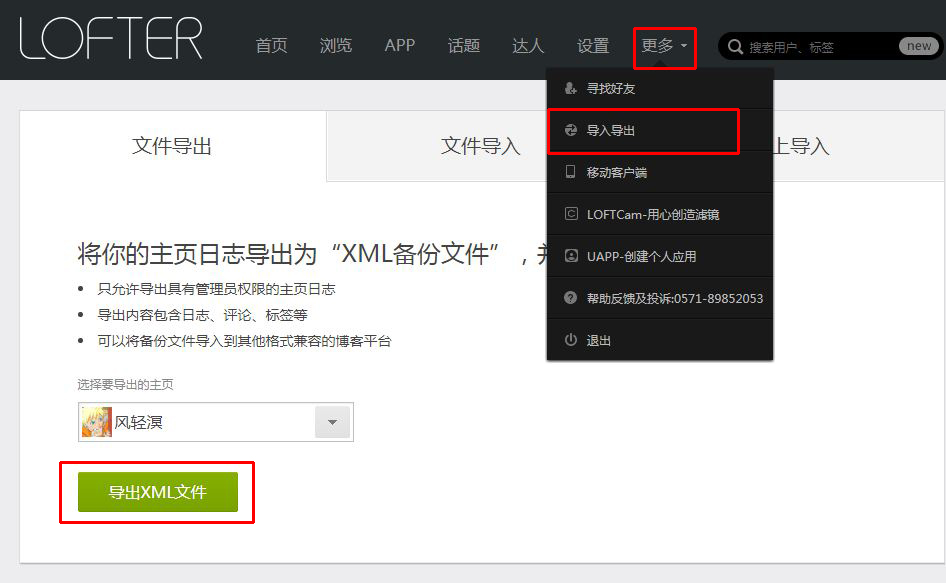
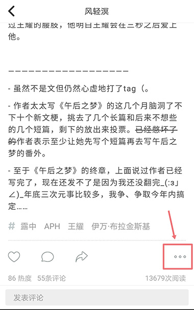
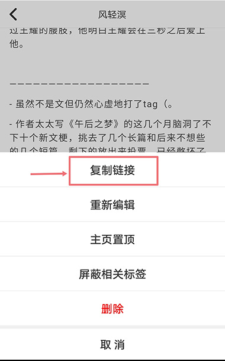
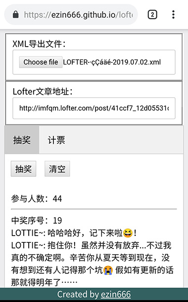
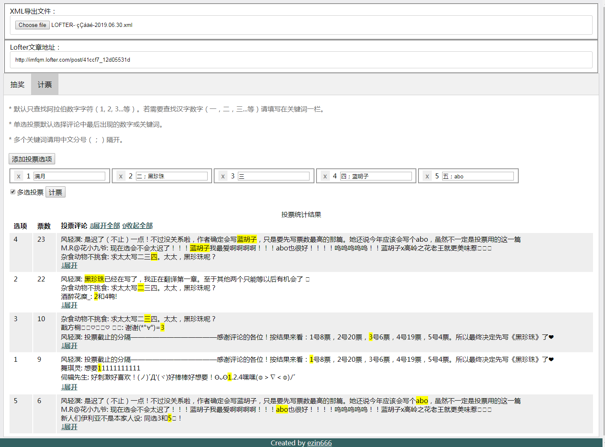

# lofter-tools v0.1 (2019.07.02)
利用Lofter自带的主页导出功能制作的自动评论抽奖与计票辅助网页工具。理论上支持任何平台5年内更新过版本的浏览器。

## 使用入口：
##### 在线地址：[简易Lofter评论抽奖计票工具](https://ezin666.github.io/lofter-tools/)

##### 下载地址：
GitHub：https://github.com/ezin666/lofter-tools/archive/v0.1.zip

度盘： https://pan.baidu.com/s/1ZeJI6Yjsv5zV5Y3Z1mrDzw 提取码: mzss 
## 所需材料：
1. 一份从Lofter下载的主页导出文件（如何导出主页↓）

2. 需要进行抽奖或计票的文章链接（PC端或浏览器直接复制地址栏的网页地址，App的话参照下图↓）

 

## 使用步骤：
1. 打开工具地址（[在线地址](https://ezin666.github.io/lofter-tools/)）或者双击打开index.html文件（[下载地址](https://github.com/ezin666/lofter-tools/archive/v0.1.zip)）
2. 选择下载好的Lofter XML导出文件
3. 输入Lofter文章网页地址
4. 选择`抽奖`或`计票`标签页
#### 抽奖：
5. 点击`抽奖`按钮。若需抽取多人，重复点击`抽奖`按钮即可。（示例图↓）

#### 投票统计：
5. 点击`添加投票选项`。每次点击就会添加一个选项。想删除某个选项只要点击选项前面的`x`按钮即可。若某个选项有关联的关键词，可以填写在选项旁边的输入框里。多个关键词用中文分号 `；` 隔开。
6. 点击`计票`按钮。（示例图↓）

## 附记
- 由于导出文件的评论列表中不包含用户主页地址，所以无法得知、也无法显示被抽中用户的主页链接，比较不方便。抽奖结果显示评论内容也是为了能够在原文章评论区搜索被抽中的用户。
- 为了保证抽取多人的情况下中奖概率不变，可抽奖人数不会随着抽奖次数减少。如果抽选到已经中奖的用户则自动重新抽选，直到没有更多可抽取用户为止。
- 计票功能有防刷票机制。单选投票的情况下一名用户仅记录最近一次有效的评论投票；多选投票则每人每个选项限计一票。
- 计票过程并不智能（。准确率并非100%。少数情况下会误计。比如带有颜文字`(:3▓▒`的评论会将表情里的`3`看成投3号一票。计票结果同时显示被统计的评论内容并且被算入票数的部分会高亮显示，也是为了方便查错。

源码地址: https://github.com/ezin666/lofter-tools

制作者：ezin666

## 更新记录：
2019.07.02 - v0.1
